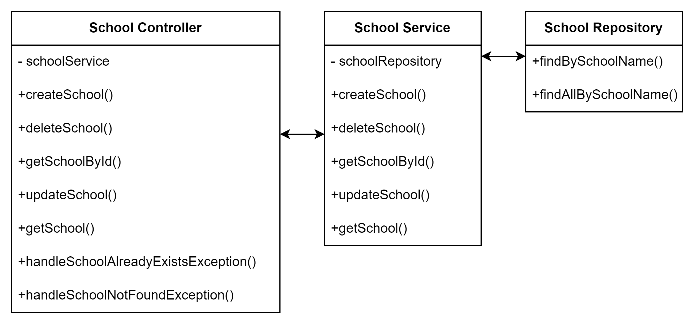
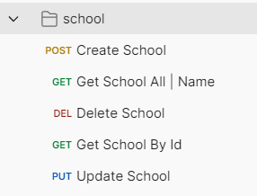

# School

This is a Spring Boot application that provides RESTful APIs to manage schools. The application allows users to create, read, update, and delete school records, as well as handle specific exceptions related to school operations.
## Project Structure
* controller: Contains REST controllers for handling API requests.
* service: Contains business logic for school operations.
* repository: Contains repository interfaces for database operations.
* model: Contains JPA entities.
* dto: Contains data transfer objects for requests and responses.
* exception: Contains custom exception classes.

### UML diagram

## Endpoints
- URL: /api/v1/schools

## Database
The application uses the H2 in-memory database. This means:

* Data is stored in memory and persists only during the runtime of the application.
* The database is initialized with sample data on application startup (data.sql or schema.sql files can be used for this purpose).
* H2 provides an embedded web-based console for easy database management during development.